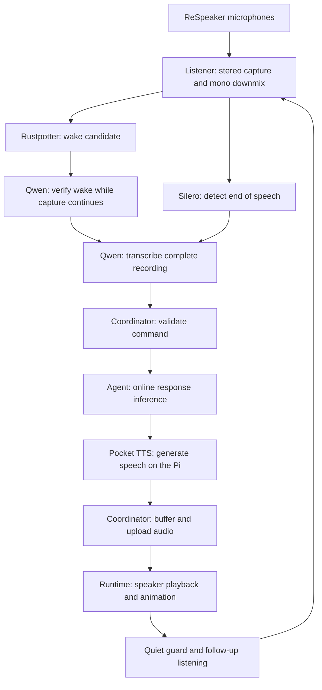

Orion is a home robot in the form of a desk lamp built to assist and interact with users at home in a warm, playful, expressive manner, and a core part of the experience is the robot’s ability to hear and understand users, as well as respond to them. 

Voice-based assistants already exist, and many users are already familiar with them in one form or the other. We wanted Orion to feel like a living character rather than another smart device, while keeping as much of its voice pipeline as possible on the robot. This resulted in us exploring various implementations in order to find the optimal fit for the robot. In the current implementation, microphone processing, wake detection, speech recognition and speech synthesis run locally on the Raspberry Pi. Response generation still uses online inference through Codex App Server, so Orion is not yet a fully offline assistant

This article walks through the entire conversation lifecycle for Orion, from how audio reaches the robot to how we process and eventually generate a response, all while maintaining core character traits and personality.


## The Overall Architecture

Orion uses an onboard computer: a Raspberry Pi 5 with 8 GB of RAM and the ReSpeaker 2-Mics Pi HAT.The Pi runs our listener process, speech inference workers, a conversation coordinator and the physical runtime. 

The listener process owns microphone capture and the listening state while our coordinator manages audio transcription jobs, command validation, AI agent invocation and tool calling. Dedicated workers perform speech recognition and text-to-speech, while the robot runtime, `oriond`, owns speaker playback and physical control of the joints and servos.

We split the architecture into these components because each handles a distinct part of the overall pipeline. For example, the microphone needs to keep receiving audio while the transcription runs; the robot’s movement and control loop also needs to keep running without being bogged down by agent response latency.





## Getting Audio Into the System

Our listener captures both microphone channels at 16 kHz, using signed 16-bit PCM in 20-millisecond frames. This lets us process the incoming sound incrementally rather than waiting for a complete recording.

We retain the stereo information from both channels in order to estimate a coarse direction, and then combine the channels into mono in order to begin wake detection and transcription.

The listener also keeps a buffer of the preceding 3 seconds of audio in memory to act as pre-roll audio, and this allows us to solve the timing problem whereby, by the time the wake detector recognises the wake word “Hey Orion”, part of the user’s audio has already passed through the microphone; so keeping recent audio in memory allows us to capture the beginning of the request we might have missed while validating our wake word.

We also provide direct mic controls to the user, so they can mute and unmute the mic whenever they want. When the mic is muted, the listener closes the capture process and clears the buffered audio.

### Dealing With Background Noise

In an ideal world, our mics would pick up just the user’s voice, but that’s rarely the case, and we actively need to avoid treating unrelated sounds as a request.

For Orion, we do this at different levels. The first being the hardware level. The Listener configures our microphone to use a fixed capture gain of 25dB and disables the codec's automatic gain control. This is done to establish a baseline capture gain for our mics and make things a little easier for our voice pipeline. Since increasing gain also increases the noise we have to process, it doesn’t directly correlate to better capture quality.

The next layer is at the software level, using voice activity detection(VAD), we are able to estimate which parts of the incoming audio contains speech, and also when a command begins and ends, but it does not remove background noise or establish that the speech is directed at Orion.
## Wake Word Detection

For Orion, we decided to follow a wake word approach, where in order to speak with the robot, we first have to say our wake word, which is “Hey Orion”.  The reasoning behind this is the form factor we currently have for Orion. Since Orion is a lamp, it's supposed to be unobtrusive and easily blend or fit into the background. Having the robot actively respond to all conversations around it would become annoying pretty quickly, and it defeats the purpose of a desk lamp. So we restrict interactions to when the user explicitly speaks to the robot using its activation phrase or wake word.

To achieve this, we use `Rustpotter`, a Rust implementation for wake word detection, to look for possible wake phrases in the incoming audio. This process is managed through our listener. Using a detection threshold of 0.35.

Once our wake word has been detected, we start a voice session and immediately acknowledge the user using a soft acknowledgement. For Orion, this soft acknowledgement happens in the form of a quiet chime and when Orion's state permits it a brief lighting cue.
The goal here is to let the user know that we heard the wake command, and we are now actively listening to the user.
If the short prefix is inconclusive, Orion can fall back to confirming the wake phrase from the complete recording.
## Active Listening

Once we have our wake word detection, the coordinator component kicks in. At this point, it uses an automatic speech recognition model, in this case `Qwen3-ASR-0.6B`, to transcribe a short recording around the wake word detection, up to two seconds before it and 200 milliseconds after it. We call this the wake prefix. This process does not interrupt the listener, which continues recording what the user is saying. 

The idea here is to add an extra verification layer to the wake word detection process. As mentioned earlier, we use a low detection threshold of 0.35 for our wake word detection. In our testing, the existing wake reference did not consistently recognise some of the Nigerian-accented pronunciations we tried so we lowered the detection threshold to improve sensitivity and added ASR verification to reduce false activations.

The verification process and the listening process overlap, so we are still listening to the user while the verification is happening, and we don’t lose any information. 

If the wake prefix confirms our wake phrase, we start our full acknowledgement process by moving the robot to the active listening pose. The robot faces the direction the user is speaking from, and the LED pulsing pattern becomes more prominent.
## Knowing When We've Finished Speaking

After wake detection and listening to the user, we need to know at what point the user is done, so we can hand off to further processing. To do this, we use Voice Activity Detection again to monitor the entire listening process. Our VAD implementation is the `Silero` library, and we run it locally through the ONNX runtime. 

Our `Silero` implementation estimates whether the audio we are currently receiving contains speech and maintains that estimation state across successive windows; 
It does this be estimating the probability that the incoming audio contains speech.
We enter the speech state when that probability reaches 0.5, and remain in it until the probability falls below 0.35. Using different entry and exit thresholds helps prevent uncertain audio from repeatedly switching between speech and silence. In the current implementation, recording ends after 1.2 seconds without detected speech, subject to the minimum capture duration.

We also limit capture to 30 seconds after wake detection. Including pre-roll, the complete recording can contain up to 33 seconds of audio. Recordings that hit the limit are rejected rather than passed to the agent as potentially incomplete commands.

## From recordings to active commands.

As mentioned earlier, Orion uses `Qwen3-ASR-0.6B` as its automatic speech recognition model. The model is served through a native `llama-server` process that runs on the CPU with 3 inference threads.

When our audio has been fully captured, it is wrapped in a WAV container and sent to the local model server; the model gives us back our transcribed text, and our coordinator passes it off to our AI agent. 

For Orion, we currently make use of OpenAI’s Codex app server as the inference agent. Response generation uses `gpt5.6-sol` with medium reasoning effort, though this effort level is configurable.

The agent maintains conversation context across turns and can reference local memories and a configured personality via its `SOUL.md` and `MEMORY.md` files. The agent also has access to a collection of tools such as lighting controls, timers, alarms and a web search tool. As the project advances, the plan is to extend the collection of available tools and integrations with popular apps and services.

The agent here is only responsible for response generation and tool calls, not controlling the robot; physical actions and controls still pass through Orion’s validated interfaces, and the robot runtime retains control over its movement and rest lifecycle.

As the agent produces its final answer, we pass complete sentences to the speech worker while the rest of the response is still being generated. This allows response generation and speech synthesis to overlap without sending individual unfinished tokens directly to TTS.

## Speech Streaming

At this point, we have only completed half of the interaction with Orion; the next step is to actually let Orion speak to the user and provide a response.

Orion uses Pocket Text-To-Speech (TTS), with `pocket-fp32` and `pocket-int8` variants available. The default configuration uses FP32 and the `Alba` voice, but the worker also supports `Anna`, `Azelma`, `Cosette`, `Eve`, `Fantine`, `Jane` and `Vera` voices.
The Pocket model loads once into its worker, and we cache the conditioning state for each selected voice. That state gives the model the voice information it needs for generation, and caching allows us to reuse the state, so we avoid preparing the same preset again for every sentence.
The model generates audio progressively at 24 kHz. We validate the samples, convert them to signed 16-bit PCM and stream them in chunks. Conversion preserves the relative level between chunks, avoiding the volume pumping that independent chunk normalisation could introduce.

Speech Recognition and Text-to-Speech use separate worker processes. Each worker keeps its model loaded between successful jobs, and jobs run serially within that worker. The coordinator communicates with these workers through private pipes, and small JSON messages identify the job and describe the audio bytes belonging to that job. The combination of Job IDs, chunk sequence numbers and explicit end messages lets the coordinator check that it received the expected response in full.


Getting the first audio chunk is only part of making a reply playable. Our speaker consumes one second of audio every second. If our speech generation produces audio more slowly than that, playback eventually runs out of samples, and we have gaps in the audio playback.
For example, imagine it takes 1.5 seconds to generate each second of speech. If we start playing the first available second, the next one will arrive too late, and we will have a reply full of gaps, which is not a good user experience.
To get around this, we measure the speech generation speed and build an audio reserve before starting playback. The startup target is the larger of six seconds of audio or twice the longest measured generation step plus two seconds.

```text
startup reserve = max(6 seconds, 2 × longest generation step + 2 seconds)
```

Once six seconds of audio have accumulated, the coordinator checks to see if our speech generation has taken more than 75% of the produced audio's duration, which essentially means that the coordinator checks to see if our TTS is keeping up well enough to make streaming worthwhile in the first place. 
Suppose Pocket produces eight seconds of speech in seven seconds. That is faster than real time on average, but it does not meet Orion’s more conservative streaming threshold. Because 7 ÷ 8 is greater than 0.75, the coordinator buffers the complete response before uploading it. This trades a longer initial wait for a lower risk of running out of audio during playback.

The coordinator also checks to see if the required reserve exceeds twelve seconds; in this case, the TTS speed is deemed too low for streaming playback, so we wait for the entire audio generation first before proceeding

## Speech Animation


While our reply plays, we need the robot to actually move as well; characters don’t just stay still while talking, and our robot should not do so as well. For Orion, we use the generated waveform to plan the motion. The runtime measures audio energy in 20-millisecond windows and smooths it to identify quiet regions and stronger peaks. These features give the movement system timing cues for sways, tilts and emphasis nods.
The gestures we use for the robot are from already defined character poses, but the runtime adjusts and aligns them to the existing speech. The lamp head establishes the direction of a phrase, then the shoulder and elbow follow. Larger body beats are reserved for sufficiently strong, spaced peaks, and recent gesture history reduces immediate repetition. We also use the LEDs as a supporting cue for the animation, in line with the audio energy. As more audio arrives, the planner extends the performance at gesture boundaries while preserving commanded position and velocity, and at the end of the speech animation, the robot settles back to it's pre-speech anchor—the stable reference pose around which the speaking gestures were generated.
## Keeping the Conversation Open

As with all conversations, we allow for follow up responses, on Orion, after successful playback, Orion opens a five-second follow-up window in which the user can issue another command without repeating “Hey Orion.”  this is to simulate the natural flow of a conversation, Before opening this window, the listener briefly discards audio and waits for quiet to reduce the risk of capturing the robot’s own voice. 
The robot also uses a soft LED pulse as visual indication that the robot is actively listening for any follow up from the user. Once the user starts speaking, the follow-up follows the same speech detection and end-of-utterance rules as a normal command, so the five-second window limits the wait for speech to begin, rather than the length of the command. 
Since our agent already maintains the the context across several turns, the conversation flow here is seamless and the robot can keep the conversation coherent. If no speech is detected, Orion returns to listening for the wake phrase.


## Lessons Learned

This design is the first iteration of what we hope will become a robust speech pipeline for home robots, and it has come with several challenges.

One limitation is handling sound in the room. Orion does not yet have acoustic echo cancellation, which removes the robot’s own speaker output from the microphone signal, or a dedicated denoising stage to reduce background noise. This means television audio, household sounds, and lingering speaker echo can affect speech detection and recognition. We reduce the risk by suspending wake detection during playback and waiting briefly for quiet before accepting a follow-up. These measures help, but users still need to wait for the LED listening light before speaking.

The onboard Raspberry Pi has 8 GB of memory, shared by the operating system, robot services, and speech models. That gives us a limited budget for everything running at once. Keeping the speech models loaded avoids loading them again for every request, but also keeps memory occupied between conversations. Model size, memory use, and response speed therefore have to be considered together.

Response time is another challenge. Orion has to detect the end of a command, transcribe it, get an answer from the agent, and turn that answer into speech. Each stage adds to the wait. In Pi trials, Pocket’s full precision model has sometimes generated audio more slowly than it can be played, requiring the coordinator to wait for the complete audio response before starting playback. We allow complete answer sentences to reach Pocket while the agent is still writing the rest, which lets some of this work happen at the same time.

We also give the user feedback throughout that wait. Orion’s thinking animation uses a gentle head tilt and small supporting movements, while a breathing LED effect shows that processing is still underway. These cues help the user understand that Orion has heard them and is preparing a response, even when speech takes a while to begin.

This first iteration has shown us how much a conversation depends on the steps around the models: knowing when to listen, handling sound from the speaker, working within the computer’s limits, and making delays understandable. Further work on echo cancellation, background noise, and speech generation speed will help Orion respond more naturally in everyday home environments.