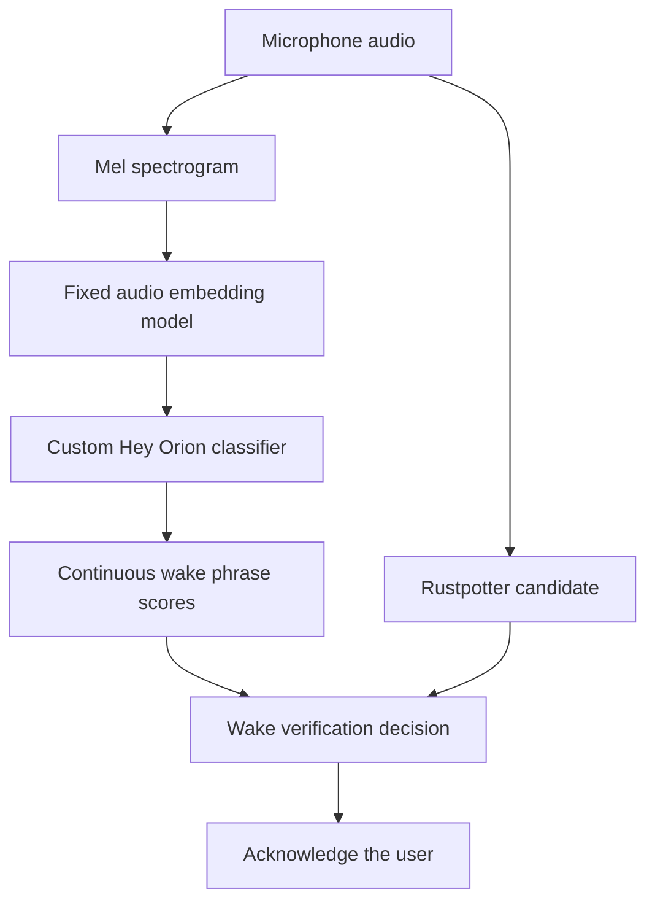

There's really no point having a personal or home robot that can't recognise when you're speaking to it.  In addition to recognising that we are speaking to the robot, the interaction also has to feel smooth, like an actual conversation with a human would feel. So when we say “Hey Orion”, we want our robot to acknowledge us quickly enough that the interaction feels natural. 
Orion takes the form of a desk lamp,  and uses a combination of sound cues, lighting and movement to show it is listening. If we have a visible pause after calling its name, it makes the interaction feel sluggish and it feels less attentive.

While we need to respond smoothly to user commands, we also need to avoid responding to sounds that naturally occur within the environment, such as vehicles, TV, or other conversations around the robot.
Our previous approach used `Rustpotter` as a wake word detection model to identify when Orion's wake word had been spoken (proposing a wake), then we had an additional verification step where we use `Qwen`  speech recognition and a short snippet of the user's utterance clipped around the potential wake word, to confirm that the proposed wake was correct, if this short check failed, we had a longer check that waited until the user was done speaking, and transcribed the entire user speech, to check if it contained our wake word.  
After measurements, Qwen’s short wake word verification check took about 1.3 seconds of inference at the median in controlled replay, and often failed to confirm the phrase, resulting in us having to transcribe the entire user utterance and thereby significantly delaying our robot's acknowledgement actions , In order to solve this problem, we decided to train a custom acoustic model to shorten that visible gap.

In [[Giving Orion a Voice - How Our Robot Listens and Speaks]], we walked through Orion’s conversation pipeline. In this article, we focus on the training run, how we built the data, trained the wake phrase classifiers, and evaluated how they would behave inside that pipeline.

## The Part of the Conversation We Wanted to Improve

`Rustpotter` gave us a useful first stage. It processed microphone audio as it arrived and proposed a candidate when the sound resembled our wake phrase. Qwen then transcribed a short recording around that candidate. If the text began with “Hey Orion”, we could confirm the wake and begin the full acknowledgement while the listener continued recording the command.
We had two distinct `rustpotter` models:

1. **Reference model:** built from six recordings of someone saying “Hey Orion”. It compares incoming sound with those examples and triggers when the similarity is high enough. Creating this reference does not train a neural network.
2. **Trained model:** a small neural classifier trained on labelled examples of “Hey Orion” and negatives such as background sound and similar phrases. It learns to distinguish the wake phrase from those negatives.

The short recording (prefix) contained up to two seconds before the candidate wake word and about 200 milliseconds after it; in controlled replay, Qwen confirmed 22/28 prefixes with the reference detector and 6/28 with the trained model, sending the rest to the complete utterance check. 
Prefix inference took about 1.3 seconds at the median, but waiting for the required audio, and checking the complete recording when the short check was inconclusive, increased the estimated confirmation time to about 2.1 seconds after phrase end for the reference model and 6.0 seconds for the trained model. These measurements were made using recorded audio and did not include other latencies such as scheduling time, communication time and physical robot actions.

We wanted a small acoustic verifier that could answer a narrower question: whether the recent audio contained our wake phrase. Qwen would still transcribe the complete command and check its opening before any command ran. The custom model would provide an earlier decision for acknowledgement in order to improve the user experience.

## Establishing Our Wake Detection Baseline

Our lab already contained real recordings of “Hey Orion”, recordings of background sound, and guided sessions captured through the robot’s microphones. We used these to establish a common basis for comparing models.

Rustpotter offers two ways to detect a wake phrase. A reference model compares incoming audio with a small set of recorded examples; ours used six recordings of “Hey Orion”. A trained neural model learns from labelled examples of the wake phrase and sounds it should ignore. We explored both approaches.

For our first training experiment, we used Piper TTS to generate wake phrases, similar sounding phrases and ordinary speech across 50 simulated voices. We combined this speech with recorded background audio and trained three small Rustpotter models. Each trained for 1,000 epochs, meaning 1,000 passes through its training data. We then tested all three against the same real recordings.

We also trained a model using only real recordings. We selected 38 recordings that we had listened to and confirmed contained “Hey Orion”, then created four variations of each. Together with 600 background clips and one “Hey Ryan” example, this gave us 753 training files. We trained this model for 300 epochs at a learning rate of 0.017, which controls the size of the model’s learning adjustments, and evaluated it using recordings captured through the robot’s microphones.

Each Rustpotter model served as the first detector: it identified a possible wake phrase. Qwen supplied the second stage by transcribing audio around that detection to confirm what had been said. We tested this complete sequence to measure how the detector’s timing affected Qwen’s confirmation. The resulting delays motivated us to train a dedicated acoustic verifier that could recognise “Hey Orion” more quickly.

## Reusing an Audio Model

For the custom verifier, we used `openWakeWord 0.6.0`. Its audio pipeline converts sound into a mel spectrogram, which represents how energy at different frequencies changes over time. A pretrained embedding model then converts that representation into numerical features that describe the sound.

We kept openWakeWord’s spectrogram and embedding models unchanged. Together, they turn incoming audio into numerical features that a classifier can use. We trained only the small classifier that reads those features and scores how strongly the audio matches “Hey Orion”.

The classifier receives the latest 16 embeddings, each containing 96 values, and produces a score between zero and one. Higher scores indicate a stronger match to the wake phrase. A threshold determines when that score is sufficient to accept a candidate.

Before generating the full dataset, we ran a small experiment to check whether openWakeWord’s audio features could help recognise “Hey Orion”. We trained a simple classifier on 38 confirmed wake recordings and 3,425 background audio segments. We then evaluated it on a separate set of 28 reviewed wake recordings captured through the robot’s microphones, and it recognised all 28, it also rejected 17 background sounds that had triggered our Rustpotter models, and produced no detections during approximately 19 minutes of background audio. This gave us enough evidence to proceed with the larger training pipeline.
## Building the Speech Dataset

Recording thousands of examples ourselves would give us many repetitions of a small number of voices, so we used Piper text-to-speech to generate a wider range of voices, then added reviewed real recordings in a separate training comparison.

Our two Piper voice banks provided 1,013 speaker identities: 904 from `en_US-libritts_r-medium` and 109 from `en_GB-vctk-medium`. We assigned approximately 85% of those identities to training and 15% to synthetic validation before generating the corpus. Validation therefore used synthetic voices that the classifier had not trained on.

Each speaker generated both wake phrases and negative phrases. This matters because a model can learn shortcuts. If one voice only says “Hey Orion” and another only says unrelated phrases, the classifier could recognise the voices instead of learning the phrase. Giving each identity both classes makes the words the useful distinction.

### Checking the Pronunciation

The spelling in a text-to-speech prompt does not guarantee the sound in the output. “Orion” and “Ryan” are close enough that we needed to check the generated audio before assigning a positive label.

We supplied Piper with phonemes, the individual sounds that make up the words, and varied speaking speed and its synthesis noise settings. We first listened to 120 examples covering 40 voices and three pronunciation variants. That review informed our choice of pronunciation for each voice bank: a short pause between the words for the US bank, and our main pronunciation variant for the British bank.

We then used two local Whisper models, `base.en` and `small.en`, to screen every generated positive. Both had to recognise “Orion”, and the screening rule excluded transcripts containing competing names such as “Ryan”, “Brian” or “O’Brien”. Clips that did not pass were discarded. Deliberate negative phrases were generated separately.

We checked the automatic screen against the human labels. Of the 51 clips it would keep, 47 had been labelled as Orion, giving about 92% precision on that sample. We also listened to a fresh sample of 40 retained clips from new speakers. We labelled 36 as Orion, meeting our 90% review threshold.

Across the full run, we generated and screened 40,520 positive candidates. We excluded speakers if fewer than half their attempts survived, removing them from both classes. This left 29,440 eligible positives across 909 speaker identities. From these, we assembled 20,000 training positives and 3,000 validation positives, each paired with a negative from the same speaker.

| Synthetic split | Wake phrases | Matched negative phrases |
| --- | ---: | ---: |
| Training | 20,000 | 20,000 |
| Validation | 3,000 | 3,000 |

### Teaching the Model What to Ignore

Our negative speech included phrases such as “Hey Ryan”, “Hey Brian”, “Hey onion”, and “Hey Oreo”, along with “Orion” and “Hey” on their own. We also generated additional confusing phrases using the upstream adversarial text helper.

We made an explicit choice about the activation phrase: “Hi Orion”, “Hello Orion”, “Okay Orion” and “Yo Orion” were negatives. We wanted the model to learn the complete “Hey Orion” phrase. These greetings were also measured separately during validation so we could see how well the classifier distinguished them.

Before extracting features, we checked every speech example for duration and label suitability. Phrases could be at most 2.8 seconds long so they would fit intact inside a window of three seconds with room for timing variation. For negative text, we used a pronunciation dictionary to check that it did not contain the phoneme sequence for “Hey Orion”. The final corpus preserved the matched speaker and class counts.

Speech was only part of the negative data. We added local background windows, Gaussian and pink noise, silence, and the upstream ACAV100M feature collection representing about 2,000 hours of audio. We also replayed Rustpotter over the training portions of our background recordings and retained 59 usable windows around its candidates. Those examples let the verifier learn from sounds that were particularly relevant to our first detector.

## Keeping Training and Evaluation Separate

We separated the data used to train the models from the data used to evaluate them. Generated speech from one group of voices went into training, while a different group supplied validation examples to help us choose between saved versions of the model. Our reviewed original recordings supplied the real speech training examples. We used the guided robot recordings and 1,150 seconds of background audio to evaluate the resulting models.
 
We also used a separate collection of audio features supplied by openWakeWord, representing 11.3 hours of audio. This helped us compare how often each checkpoint incorrectly gave background audio a high wake score.

That separation applied to everything mixed into a recording. Training and validation used different noise files and room responses, which simulate how sound reflects in a room. When we took training and evaluation background clips from the same long recording, we left an unused gap between those sections to prevent overlap.

For example, a validation recording could contain a voice the model had never heard but background sound it had already trained on. We therefore tracked every ingredient in each mixture, including the speech, noise and room response, and checked that each belonged to the correct data group.

For every example, we recorded its source files, speaker, phrase timing and processing settings. File hashes let us check that the source audio had not changed, while saved random seeds let us repeat the same choices during generation and augmentation. These records linked each set of extracted features to the audio and processing that produced it.

## Making the Audio Resemble the Robot’s Input

Clean generated speech only covers a small part of what a microphone hears in a room. We used augmentation to vary the acoustic conditions around each phrase.

Our augmentation recipe kept approximately 20% of its examples clean. For the others, we added noise and applied recorded room impulse responses, which simulate how a room reflects and colours sound. The configuration applied a room response to roughly 70% of examples overall. Noise levels varied over a signal-to-noise ratio of 5–20 dB, exposing the model to speech with different amounts of interference. Every validation clip also had a separate clean copy for comparison.

We also varied the audio level within the range measured from the robot's recordings. Those measurements informed the transformation; the development waveforms themselves stayed out of the training mixtures. Some training mixtures included a small offset in the waveform to represent the offset observed in our microphone recordings.

Each phrase sat inside a window of three seconds, with its end placed randomly within the final 200 milliseconds. Negative phrases used the same placement rule. This prevented position inside the window from becoming another shortcut for the label.

The window also had genuine preceding audio, so the model encountered the phrase after background sound or other speech. We randomised where the audio fell relative to the processing frame boundaries. In a live microphone stream, a person can begin speaking at any point within a frame, and our training examples needed to reflect that.

We verified that mixture recipes reconstructed the same audio during the run.

## Extracting Features as the Audio Arrives

Orion’s listener receives microphone frames of 20 milliseconds. The openWakeWord feature extractor processes 80 milliseconds at a time, so four listener frames form one input chunk. At 16 kHz, that is 1,280 samples.

We used this streaming route for every feature we computed locally, including training and validation. We fed audio through the fixed backbone in order and captured the latest 16 embeddings for the classifier. We required at least 26 frames of genuine audio before a snapshot was eligible, allowing the feature history to fill with actual input.

This is a useful detail to get right when training a model for continuous audio. Processing a complete file in one call can produce different features from processing the same sound in small chunks. Using the streaming path made our local training inputs consistent with how the verifier would receive audio on the robot.

We cached the resulting arrays so each training run could reuse them. The downloaded ACAV and selection features retained the upstream extraction method, so we also compared model scores on those features with scores on our streamed local background. That difference remained part of the experiment’s interpretation.

## Training the Classifiers

We first ran a small pilot with 200 synthetic positives and 200 matched negatives, including a validation portion of 40 examples per class from reserved identities. Its 2,000 training steps exercised the learning process after generation, screening, augmentation and feature extraction. We also exported the model and measured the resources needed before committing to the full corpus.

Its selected checkpoint achieved a clean validation ROC AUC of 0.9175. AUC measures how well the model ranks positive examples above negatives across possible thresholds; 0.5 would be chance ordering and 1 would be perfect separation on that sample. We also checked that positive scores had moved clearly above negative scores. These checks showed that the pipeline was learning the phrase.

For the full run, we compared three configurations:

| Model  | Wake speech used for training              | Hidden layer width |
| ------ | ------------------------------------------ | -----------------: |
| S-32   | Synthetic speech                           |                 32 |
| S+R-32 | Synthetic speech plus reviewed real speech |                 32 |
| S-128  | Synthetic speech                           |                128 |

The real speech model added 20 augmented versions of each of the 38 reviewed wake recordings, giving 760 additional positive examples. It also added 20 versions of each of two reviewed negatives, “Hey Ryan” and “Hey”, for 40 negative examples. These were variations of the original recordings, so they increased acoustic variety without increasing the number of real speakers.

The network flattened the 16 × 96 input into 1,536 values, passed it through a small fully connected network, and produced one wake score. The width in the table is the number of units in its hidden layers; increasing it gives the classifier more capacity to learn patterns. We trained the classifier on a CPU while keeping the spectrogram and embedding models fixed.

Each full run used 50,000 training steps, the Adam optimiser, and a target learning rate of 0.0001. The learning rate increased during warmup, held steady for part of the run, then decreased using a cosine schedule. Each sampled batch contained 1,024 examples: 50 positives, 50 confusing speech negatives, 800 ACAV examples and 124 local background or noise examples.

That batch contains many more negatives than positives because the listener spends most of its time hearing something other than the wake phrase. We used binary cross-entropy loss, which penalises a score according to how far it is from the correct label. We averaged this loss separately for positives and negatives, then combined the two contributions. The negative contribution gradually increased from half strength to full strength. This let us expose the model to broad background variation while retaining a meaningful learning signal from the positives.

We also focused updates on examples the model had not already classified with high confidence. Checkpoints preserved the model, optimiser, random generator state and any accumulated gradients so an interrupted run could resume consistently.

## Choosing a Checkpoint

We saved a checkpoint every 2,500 steps. To choose among them, we first required evidence that the classifier separated wake phrases from negatives. We then preferred fewer false positive windows on the upstream selection set, followed by better recall on clean and augmented synthetic validation audio.

We also evaluated an average of the best checkpoints. In all five completed full runs, an individual checkpoint ranked better than the averaged alternative and supplied the selected model.

The S-128 configuration ranked best in the initial validation and selection comparison, so we trained it with two additional seeds. S+R-32, the model we use, was trained with a single seed, so its variation between training runs is unmeasured.

We chose checkpoints and the architecture for the extra seeds before evaluating the robot's development sessions. We also recorded thresholds chosen from synthetic validation and the upstream selection set before running the wider development grid. That kept the training choices traceable and allowed the later listener comparison to answer a separate question about system behaviour.

Each classifier was exported to ONNX, the model format used by our inference runtime. We compared its output with the PyTorch model on 200 feature windows per full run. The largest difference across the five exports was approximately 0.00000051, below our 0.00001 tolerance. This checked that exporting the trained model preserved its scores.

## Testing the Whole Listening Process

A classifier score only becomes useful when we know how it affects the listener. We replayed the three complete robot recording sessions in chronological order, using the 28 approved wake phrases and their annotated times. We also replayed continuous background, matched background controls, and noise controls.

The acoustic model produced scores continuously. When Rustpotter proposed a candidate, the verifier could inspect recent scores or wait briefly for a new score. If a sufficiently strong score already existed, it could accept at the candidate time. For example, a wake score might peak just after the user finishes saying “Orion”, then fall before Rustpotter fires. Keeping recent scores lets us use that peak as soon as the candidate arrives.

We compared two rejection policies. One kept the full Qwen check as a fallback when the verifier did not accept in time. The other immediately returned to listening after the verification deadline. We also evaluated openWakeWord acting as the detector on its own.

The simulator included the listener’s listening, pending and busy states, Rustpotter resets, and speech endpointing through the release Silero model. An earlier candidate could occupy the listener and affect a later phrase. This let us measure the effect of the verification policy across a session.

Across five classifiers, we completed 7,930 settings covering detector thresholds, verifier thresholds, score history lengths, deadlines and rejection policies. We recorded timely wakes, missed phrases, rejected candidates, background accepts and latency for each setting.

## What the Completed Run Showed

S-128 ranked best on synthetic validation and background selection, but S+R-32 performed better when we replayed real recordings through the complete listener. We chose S+R-32 because it met our development requirements, recognising all 28 approved wakes in time.
So our final pipeline became the rustpotter reference model at 0.35 plus our S+R-32 model.

The model comparison happened in two stages:

| Evaluation stage                                       | What we found                                                                                                                                 |
| ------------------------------------------------------ | --------------------------------------------------------------------------------------------------------------------------------------------- |
| Synthetic validation and upstream background selection | **S-128 ranked best**, under a rule that prioritised fewer false positive windows after checking that the model had learned.                  |
| Complete listener replay using real Robot recordings   | **S+R-32 passed** with 28/28 timely wakes. S-128 reached **at best 21/28** across its grid, and none of its settings passed all requirements. |

Development results:

| Measure in the development replay | Result |
| --- | ---: |
| Timely approved wake phrases | 28 / 28 |
| Rejected selected background candidates | 17 / 17 |
| Accepted events in 1,150 seconds of background | 1 |
| Accepted events in 28 matched control slots | 1 |
| Accepted events in Gaussian noise controls | 0 |
| Median acceptance time after phrase end | 0.520 seconds |
| 95th percentile acceptance time after phrase end | 0.666 seconds |

The trained Rustpotter at 0.80 also passed: 27/28 timely wakes, a median of about 0.81 seconds, and zero background and control accepts. We ultimately chose  the reference rustpotter model because of its for its 28/28 wake word detection score and faster median, while we kept the trained model for comparison.

Across 26 matched timely candidates, the verifier’s 95th percentile added wait was zero: its score history already contained the evidence. Replay excludes live scheduling, communication and physical acknowledgement, preventing an exact live speedup comparison with Qwen.

S-128 led before development replay. Synthetic-only models reached at best 14 to 21 of 28 timely wakes; none passed. Only S+R-32, trained with our reviewed recordings too, passed. Those recordings probably cover one speaker, effectively tuning the verifier to that voice; broader performance is unmeasured.

## Lessons Learned

For Orion, building a custom wake model meant shaping the entire process around a small moment in the interaction. The phrase had to be pronounced correctly in the generated data, the classifier had to see realistic sound around it, and its decision had to arrive at a useful point in the listener’s timeline.

Generated voices gave us scale, but only the model that also heard our reviewed recordings passed. We therefore have a verifier effectively tuned to one speaker’s voice, with performance on other speakers still to establish. Measuring fresh voices and sessions will tell us how much of the replay improvement people actually feel when they speak to Orion